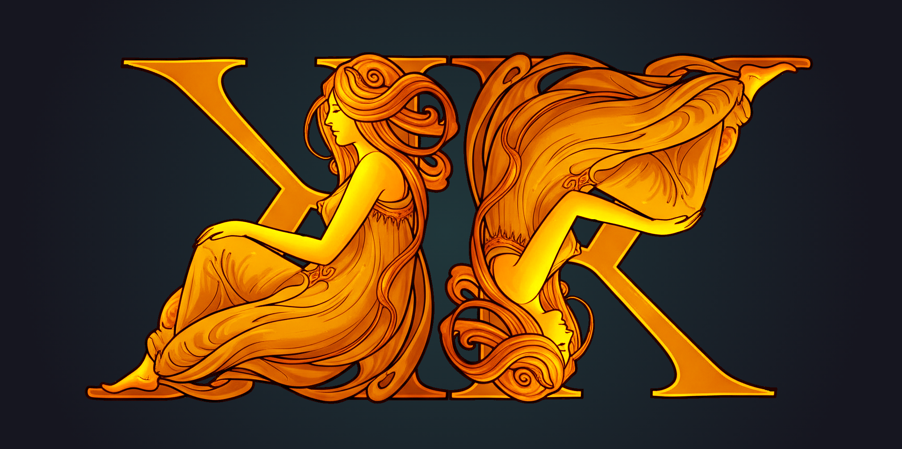
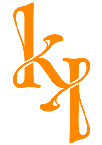

#  KouraiKhryseai

[](https://search.maven.org/artifact/com.github.josemg08/kourai-khryseai)
[](https://github.com/josemg08/KouraiKhryseai/blob/master/LICENSE)
[](https://android-arsenal.com/api?level=21)

> "These are golden, and in appearance like living young women. There is intelligence in their hearts, and there is speech in them and strength..." - Homer, Iliad 18.417-420

##  Overview

KouraiKhryseai (from Ancient Greek: κοῦραι χρύσειαι, "golden maidens") is an elegant Android design system library inspired by Hephaestus's legendary automata. Just as these divine constructs assisted the god craftsman in his forge, this library aims to empower Android developers in crafting beautiful and accessible applications.

##  Features

* **Material Design 3 Compatible** - Seamless integration with the latest Material Design guidelines
* **Performance Optimized** - Lightweight implementation with minimal overhead
* **Golden Ratio** - Dimension follow Fibonacci sequence to achieve natural symmetry
* **Kotlin-First** - Written in Kotlin with modern Android development practices

##  Usage

### Theme Configuration

KouraiKhryseai provides a flexible theming system through `KThemeConfig` and `KTheme`. Initialize the configuration in your `Application` class and wrap your UI with the theme composable.

#### Basic Setup

```kotlin
class MyApplication : Application() {
    override fun onCreate() {
        super.onCreate()
        KThemeConfigHolder.init(
            config = KThemeConfig()
        )
    }
}
```

#### Providing your own basic colors

```kotlin
KThemeConfigHolder.init(
    config = KThemeConfig(
        colors = KColorConfig(
            primary = Color(0xFF6750A4),
            secondary = Color(0xFF625B71),
            tertiary = Color(0xFF7D5260)
        )
    )
)
```

#### Providing complete Material 3 ColorScheme

```kotlin
KThemeConfigHolder.init(
    config = KThemeConfig(
        colors = KColorConfig(
            lightColorsScheme = ColorScheme(
                primary = Color(0xFF6750A4),
                onPrimary = Color(0xFFFFFFFF),
                // ... other colors
            ),
            darkColorsScheme = ColorScheme(
                primary = Color(0xFFD0BCFF),
                onPrimary = Color(0xFF381E72),
                // ... other colors
            )
        )
    )
)
```

##  Mythological Inspiration

In Homer's Iliad, Hephaestus - the god of craftsmanship, fire, and metallurgy - created golden handmaidens endowed with intelligence, speech, and divine knowledge. These remarkable automata served as his assistants in the divine forge, representing the perfect union of artistry and functionality.

Like these mythical helpers, KouraiKhryseai aims to be your reliable companion in Android development, providing intelligent solutions and robust building blocks for creating exceptional user experiences.
